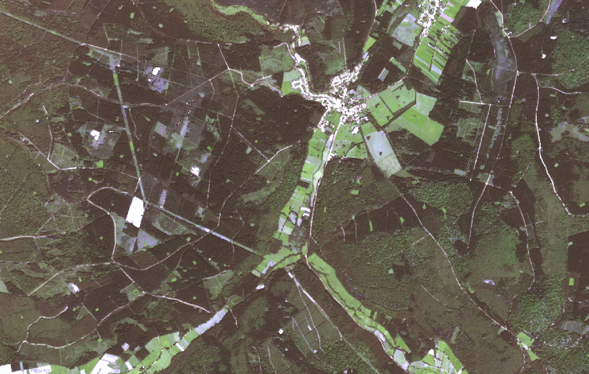
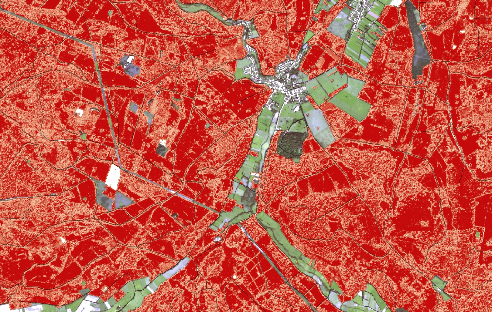
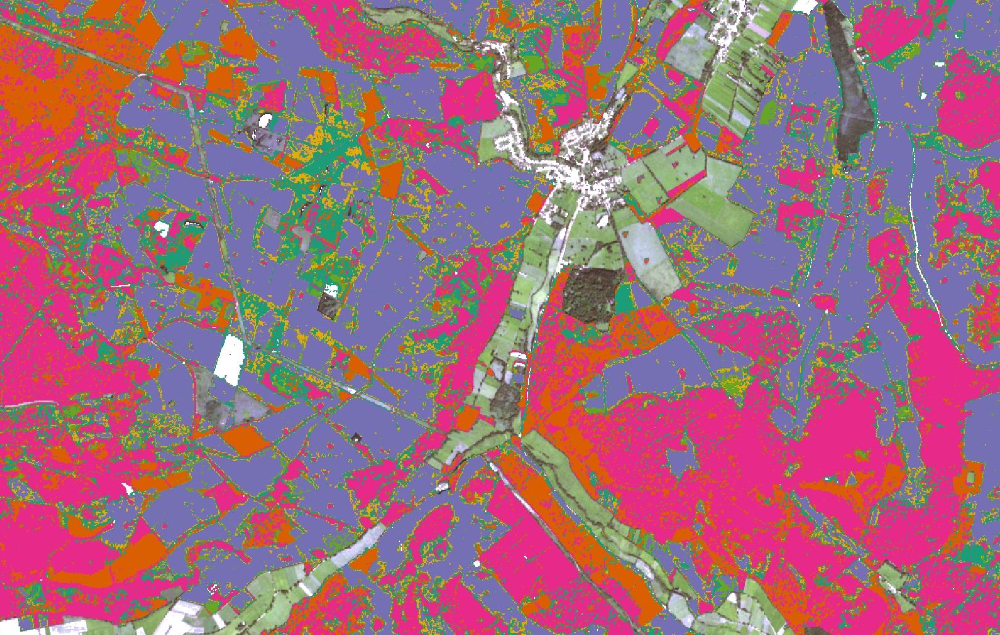
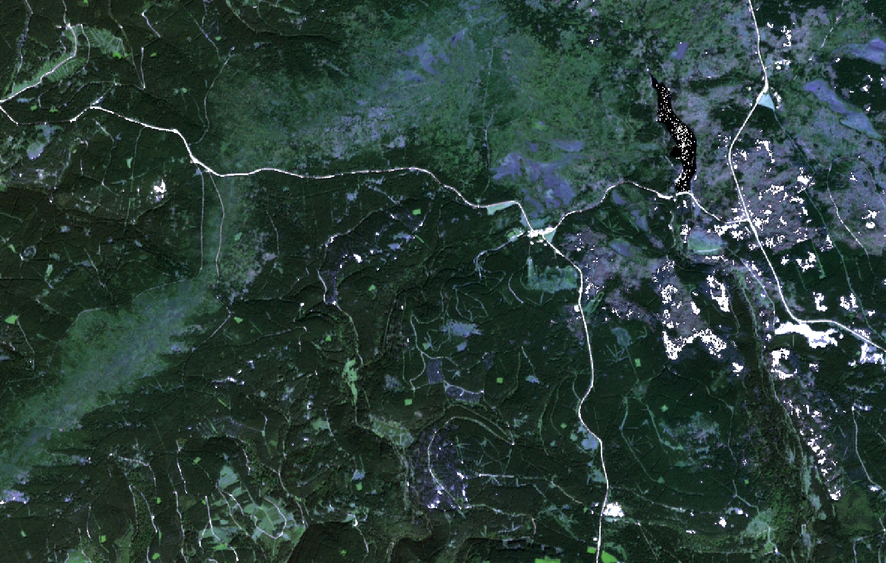
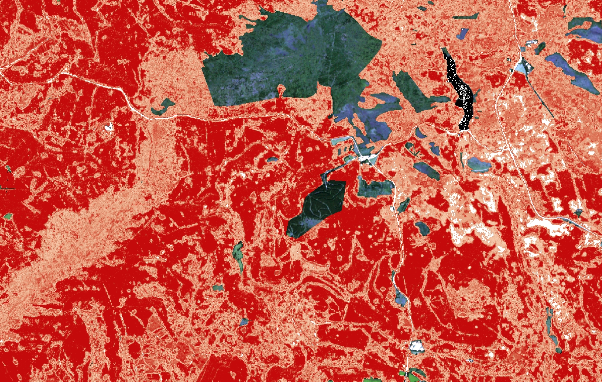
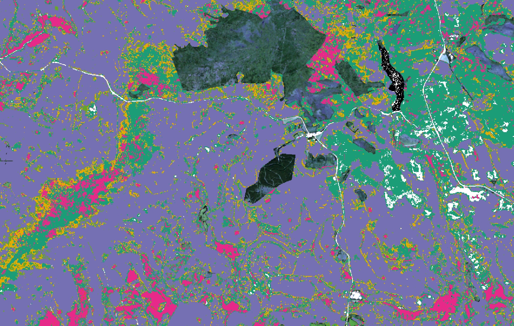
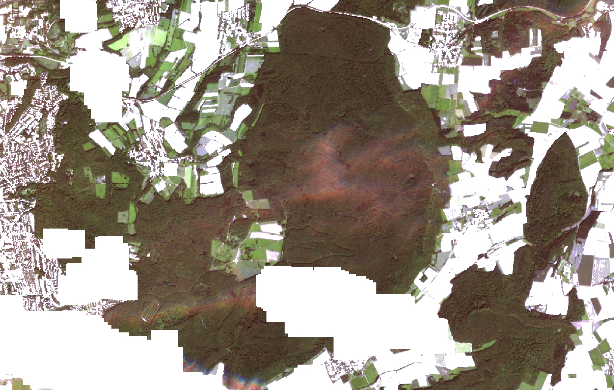
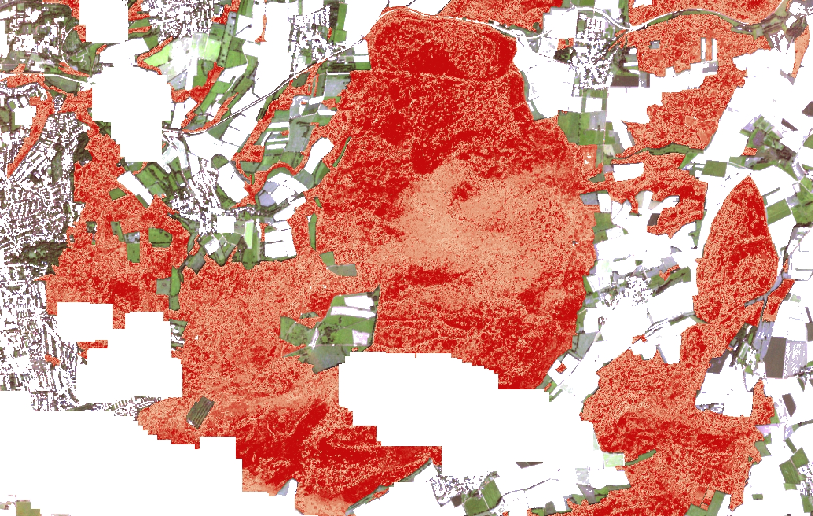
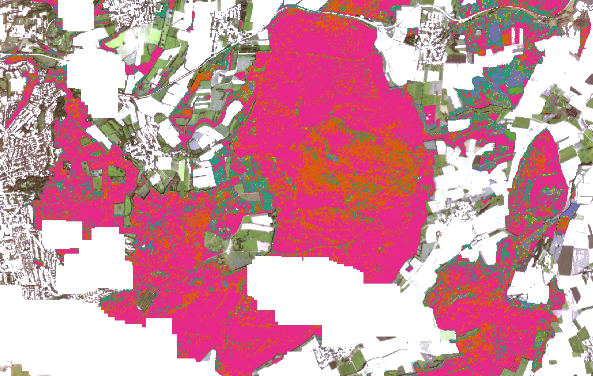

```{r global_options, include=FALSE}
knitr::opts_chunk$set(# fig.width=12, fig.height=8, 
  echo=FALSE, warning=FALSE, message=FALSE)
```

## Introduction


## Validation Steps

(classification steps and **validation possibilities**)

### Input Data
- Choice of satellite imagery (**date**, quality)
- Preprocessing steps (atmospheric, topographic, ... correction)
- Image **masking** (clouds, cloud shadows, nodata)

### Reference Data
- Choice of **reference data** (distribution)
- Label reference data
- Extraction of input data for reference areas
- Splitting in train and test data sets

### Build Classification Model
- Choice of **classification features**
- Choice of model hyperparameters

### Apply Classification Model
- Input data classification
- Class probability calculation

### Postprocessing
- Apply **filter** (Minimal Mapping Unit, Focal filter)
- **Integration of class probabilities**

### Accuracy Assessment
- Calculate accuracy metrics from validation data


-----------------


## Reference Data

```{r plot_ref_init}
library(rgdal)
library(leaflet)
library(raster)
library(formattable)
library(tidyverse)
library(plotly)
library(caret)
library(RColorBrewer)
library(kableExtra)

# load data
ref.sol <- readOGR(dsn="../data/reference/Solling", layer = "Training_Solling_2", stringsAsFactors = T, verbose=F)
ref.sol@data$site = as.factor("Solling")
ref.sol@data$BA <- plyr::revalue(ref.sol@data$BA, c("112"="Eiche", 
                    "211"="Buche",
                    "511"="Fichte",
                    "611"="Douglasie",
                    "711"="Kiefer",
                    "811"="Laerche"))
ref.sol@data$ID = as.numeric(as.character(ref.sol@data$ID))

ref.har <- readOGR(dsn="../data/reference/Harz", layer = "Training_Harz_2", stringsAsFactors = T, verbose=F)
ref.har@data$site = as.factor("Harz")
ref.har@data$BA <- plyr::revalue(ref.har@data$BA, c("112"="Eiche", 
                    "211"="Buche",
                    "511"="Fichte",
                    "611"="Douglasie",
                    "711"="Kiefer",
                    "811"="Laerche"))

ref.hei <- readOGR(dsn="../data/reference/Heide", layer = "Training_Heide_2", stringsAsFactors = T, verbose=F)
ref.hei@data$site = as.factor("Heide")
ref.hei@data$BA <- plyr::revalue(ref.hei@data$BA, c("112"="Eiche", 
                    "211"="Buche",
                    "511"="Fichte",
                    "611"="Douglasie",
                    "711"="Kiefer",
                    "811"="Laerche"))

ref.all <- rbind(ref.sol,ref.har,ref.hei)


# transform
ref <- spTransform(ref.all, CRS("+init=epsg:4326"))


# set same relative extent
ext.sol <- extent(ref.sol)
ext.dist <- min(ext.sol@xmax - ext.sol@xmin, ext.sol@ymax - ext.sol@ymin)

ext.sol@xmax <- ext.sol@xmin + ext.dist
ext.sol@ymax <- ext.sol@ymin + ext.dist

ext.har <- extent(ref.har)
ext.har@xmax <- ext.har@xmin + ext.dist
ext.har@ymax <- ext.har@ymin + ext.dist

ext.hei <- extent(ref.hei)
ext.hei@xmax <- ext.hei@xmin + ext.dist
ext.hei@ymax <- ext.hei@ymin + ext.dist


# set color palette for leaflet
pal <- colorFactor("Dark2", ref@data$BA)

# set color palette for plotly 
pal.ref <- c(brewer.pal(n = 6, name = "Dark2")) %>%
   setNames(levels(ref@data$BA))

# palette  in the order of reference data levels
pal.class <- c("#D95F02", "#E7298A", "#7570B3", "#66A61E", "#E6AB02", "#1B9E77") 

```

The reference data was sampled in three project areas (Harz, Heide, Solling).
```{r plot_ref_all, fig.cap= "Reference data sampling locations"}
leaflet(ref) %>%
  addProviderTiles(providers$Esri.WorldTopoMap) %>%
  addPolygons( color = ~pal(BA), weight = 1, smoothFactor = 0.5,
              opacity = 1.0, fillOpacity = 0.7,
              highlightOptions = highlightOptions(color = "white", weight = 2,
                                                  bringToFront = TRUE)) %>%
  addLegend("bottomright", pal = pal, values = ~BA,
            title = "Baumart",
            opacity = 1
  )
```


### Number of reference data polygons by tree species
```{r tab_ref_spec, eval=FALSE}
ref@data %>% dplyr::group_by(BA) %>% dplyr::summarise(n=n(), .groups = 'drop') %>% formattable()

```

```{r plot_ref_spec}
ref@data %>% dplyr::group_by(BA) %>% dplyr::summarise(n=n(), .groups = 'drop') %>% 
  plot_ly(labels = ~BA, values = ~n, type = 'pie',
          marker = list(colors = pal.ref,
                      line = list(color = '#FFFFFF', width = 1)))
```


### Number of reference data polygons by site
```{r tab_ref_site, eval=FALSE}

ref@data %>% dplyr::group_by(site) %>% dplyr::summarise(n=n()) %>% formattable()

```

```{r plot_ref_site}

ref@data %>% dplyr::group_by(site) %>% dplyr::summarise(n=n()) %>% 
    plot_ly(labels = ~site, values = ~n, type = 'pie',
          marker = list(colors = brewer.pal(n = 3, name = "Paired"),
                      line = list(color = '#FFFFFF', width = 1)))

```

### Number of reference data polygons by tree species and site
```{r tab_ref_site-spec, eval=FALSE}

ref@data %>% dplyr::group_by(BA, site) %>% dplyr::summarise(n=n()) %>%  spread(site, n) %>% formattable()

```

```{r plot_ref_site-spec}
ref@data %>% dplyr::group_by(BA, site) %>% dplyr::summarise(n=n()) %>%
  plot_ly(x = ~site, y = ~n, type = 'bar', color = ~BA, colors = pal.ref) 
```


-----------------


## Classification

```{r plot_class_init}

img.class <- raster("G:/B/SG4/wiesehahn/von_philip/RandomForest_Baumarten/S2B_MSIL2A_20170823T103019_N0205_R108_T32UND_20170823T103018_Dsen2_TopCorSlope10K06ndvi_VI_HrzSolHei_int1U_neu.tif")

```
### Study sites {.tabset .tabset-pills}

#### Solling
```{r plot_class_sol , fig.cap= "Tree species classification result for Solling"}
plot(img.class, col =pal.class, ext=ext.sol, axes=FALSE, box=FALSE)

```

#### Harz
```{r plot_class_har, fig.cap= "Tree species classification result for Harz"}
plot(img.class, col =pal.class, ext=ext.har, axes=FALSE, box=FALSE)
```

#### Heide
```{r plot_class_hei, fig.cap= "Tree species classification result for Heide"}
plot(img.class, col =pal.class, ext=ext.hei, axes=FALSE, box=FALSE)
```


-----------------


## Probability

The Random Forest algorithm simply counts the fraction of trees in a forest that vote for a certain class to generate the predicted class. This class probability can be generated separately and provides insights in classification certainty.

```{r plot_prob_init}
library(rasterVis)

f <- "G:/B/SG4/wiesehahn/von_philip/RandomForest_Baumarten/rfprob_masked.tif"
if (!file.exists(f)){
  img.class <- raster("G:/B/SG4/wiesehahn/von_philip/RandomForest_Baumarten/S2B_MSIL2A_20170823T103019_N0205_R108_T32UND_20170823T103018_Dsen2_TopCorSlope10K06ndvi_VI_HrzSolHei_int1U_neu.tif")
  img.prob.unmasked <- raster("G:/B/SG4/wiesehahn/von_philip/RandomForest_Baumarten/S2B_MSIL2A_20170823T103019_N0205_R108_T32UND_20170823T103018_Dsen2_TopCorSlope10K06ndvi_VI_HrzSolHei_int1U_neu_rfprob.tif")
  img.prob.masked <- mask(img.prob.unmasked, mask= img.class, filename= "G:/B/SG4/wiesehahn/von_philip/RandomForest_Baumarten/rfprob_masked.tif")
}

img.prob <- raster("G:/B/SG4/wiesehahn/von_philip/RandomForest_Baumarten/rfprob_masked.tif")

img.prob.sol <- crop(img.prob, ext.sol)
img.prob.har <- crop(img.prob, ext.har)
img.prob.hei <- crop(img.prob, ext.hei)

```

### Overview
```{r plot_prob_all, fig.cap= "Pixelwise classification probability (and average by latitude and longitiude) for the entire study region"}
levelplot(img.prob,  margin = list(axis = TRUE, scales=list(x= c(60,80), y = c(60,80))), scales=list(draw=FALSE), maxpixels = 1e6)

```

### Study sites  {.tabset .tabset-pills}

#### Solling
```{r plot_prob_sol, fig.cap= "Pixelwise classification probability (and average by latitude and longitiude) for Solling"}
levelplot(img.prob.sol,  margin = list(axis = TRUE, scales=list(x= c(60,80), y = c(60,80))), scales=list(draw=FALSE), maxpixels = 1e6)
```

#### Harz
```{r plot_prob_har, fig.cap= "Pixelwise classification probability (and average by latitude and longitiude) for Harz"}
levelplot(img.prob.har,  margin = list(axis = TRUE, scales=list(x= c(60,80), y = c(60,80))), scales=list(draw=FALSE), maxpixels = 1e6)
```

#### Heide
```{r plot_prob_hei, fig.cap= "Pixelwise classification probability (and average by latitude and longitiude) for Heide"}
levelplot(img.prob.hei,  margin = list(axis = TRUE, scales=list(x= c(60,80), y = c(60,80))), scales=list(draw=FALSE), maxpixels = 1e6)
```


### Reference Probability

Classification probabilities were extracted for each pixel inside reference polygons. The extracted values grant insight in classification certainty by tree species and reference site.

```{r plot_ref_prob_init}
clip <- crop(img.prob, extent(ref.all))

ref.prob.sol <- raster::extract(clip, ref.sol, df=TRUE)
ref.prob.sol$ID <- as.factor(ref.prob.sol$ID)
ref.prob.sol <- merge(ref.prob.sol, ref.sol@data ,by="ID", all = TRUE)


ref.prob.har <- raster::extract(clip, ref.har, df=TRUE)
ref.prob.har$ID <- as.factor(ref.prob.har$ID)
ref.prob.har <- merge(ref.prob.har, ref.har@data ,by="ID", all = TRUE)


ref.prob.hei <- raster::extract(clip, ref.hei, df=TRUE)
ref.prob.hei$ID <- as.factor(ref.prob.hei$ID)
ref.prob.hei <- merge(ref.prob.hei, ref.hei@data ,by="ID", all = TRUE)

ref.prob <- rbind.data.frame(ref.prob.sol, ref.prob.har, ref.prob.hei)

```

```{r plot_ref_prob, fig.cap= "Classification probability by site and tree species for reference data locations"}
library(plotly)

fig <- plot_ly(ref.prob, x = ~site, y = ~rfprob_masked, color = ~BA, colors= pal.ref, type = "box")

fig <- fig %>% layout(boxmode = "group", yaxis = list(title = "Probability"), xaxis = list(title = FALSE))

fig
```


-----------------


## Reference Accuracy

Class predictions for all reference pixels were extracted from the model prediction raster. These predictions were thought to be compared with the reference data label to produce an error matrix. The accuracy was expected to be biased since we used part of the reference data for training the model. But instead, all reference data was classified correctly. This might suggest that the model is overfitted to the reference data, performing very well on the reference data but weaker outside.

```{r plot_ref_class_init}
clip <- crop(img.class, extent(ref.all))

ref.class.sol <- raster::extract(clip, ref.sol, df=TRUE)
ref.sol@data$rownumber <- as.integer(rownames(ref.sol@data))+1
ref.class.sol <- merge(ref.class.sol, ref.sol@data ,by.x="ID", by.y="rownumber", all = TRUE)


ref.class.har <- raster::extract(clip, ref.har, df=TRUE)
ref.har@data$rownumber <- as.integer(rownames(ref.har@data))+1
ref.class.har <- merge(ref.class.har, ref.har@data ,by.x="ID", by.y="rownumber", all = TRUE)


ref.class.hei <- raster::extract(clip, ref.hei, df=TRUE)
ref.hei@data$rownumber <- as.integer(rownames(ref.hei@data))+1
ref.class.hei <- merge(ref.class.hei, ref.hei@data ,by.x="ID", by.y="rownumber", all = TRUE)

ref.class <- rbind.data.frame(ref.class.sol, ref.class.har, ref.class.hei)

# rename columns
colnames(ref.class)[2] <- "classification"

colnames(ref.class)[3] <- "reference"

colnames(ref.class)[1] <- "ID2"

colnames(ref.class)[4] <- "ID"


# revalue classificaton data
ref.class$classification <- as.factor(ref.class$classification)

ref.class$classification <- plyr::revalue(ref.class$classification, c("6"="Eiche", 
                    "1"="Buche",
                    "3"="Fichte",
                    "2"="Douglasie",
                    "4"="Kiefer",
                    "5"="Laerche"))
```

**Error Matrix**
```{r plot_ref_class_em}
cm<- confusionMatrix(data = ref.class$classification, reference = ref.class$reference)
cm.df <- as.data.frame.matrix(cm$table)

cm.df %>%
  knitr::kable("html", escape = F, rownames = T,)%>%
  kable_styling("hover", full_width = F) 

```


### Inventory data as reference

BWI-plots in Lower Saxony were filtered by certain criteria to serve as validation data. Only plots with a relative tree species proportion of more than 75% in the main canopy layer for one of the classified tree species groups were considered.
Class predictions for all pixels covered by these plots were extracted from the model prediction raster and compared against the inventory data.

```{r plot_bwi_class_init}
# load bwi data
ref_ni <- read.csv("../data/reference/bwi/ref_ni.csv", stringsAsFactors=TRUE)

ref_ni$BA <- plyr::revalue(ref_ni$BaGr, c("EI"="Eiche", 
                    "BU"="Buche",
                    "FI"="Fichte",
                    "DGL"="Douglasie",
                    "KI"="Kiefer",
                    "LAE"="Laerche"))

ref_ni.sp<- SpatialPointsDataFrame(coords = ref_ni[,c("GK3_Rechts", "GK3_Hoch")], data = ref_ni, proj4string = CRS("+init=epsg:31467"))

# transform
ref.bwi <- spTransform(ref_ni.sp, CRS("+init=epsg:4326"))


ref.class.bwi <- raster::extract(clip, ref.bwi, df=TRUE)

ref.class.bwi <- merge(ref.class.bwi, ref.bwi@data ,by.x="ID", by.y="X", all = TRUE)

# rename columns
colnames(ref.class.bwi)[2] <- "classification"

ref.class.bwi <- ref.class.bwi %>% rename(reference = BA)


# revalue classificaton data
ref.class.bwi$classification <- as.factor(ref.class.bwi$classification)

ref.class.bwi$classification <- plyr::revalue(ref.class.bwi$classification, c("6"="Eiche", 
                    "1"="Buche",
                    "3"="Fichte",
                    "2"="Douglasie",
                    "4"="Kiefer",
                    "5"="Laerche"))

ref.class.sp <- sp::merge(ref.bwi, ref.class.bwi, by= c("Tnr", "Enr"))

#mapview(ref.class.sp, zcol="reference", col.regions = pal.ref)

library(spdplyr)
misclassified <- ref.class.sp %>% mutate(result = if_else(classification != reference,"wrong", "right"))
#mapview(misclassified, zcol="result", col.regions = c("green", "red"))
```


**Error Matrix**
```{r plot_bwi_class_em}
cm<- confusionMatrix(data = ref.class.bwi$classification, reference = ref.class.bwi$reference)
cm.df <- as.data.frame.matrix(cm$table)

cm.df %>%
  knitr::kable("html", escape = F, rownames = T,)%>%
  kable_styling("hover", full_width = F) 

```


**Respective Accuracy**
```{r print_ref_acc}
print(cm$overall[1:2])
```


## Misclassifications

```{r ref_mis_init}
misclassified <- ref.class.bwi %>%
  filter(classification != reference)

```


### Masking

#### Tracks, Ways, ect. {.tabset .tabset-pills} 

Forest tracks, ways and official streets cut through the forest. Along these lines the spectral reflectances are heavily influenced by the surface material. Hence, the classification certainty is much lower along these features and tree species might be classified wrong.

##### Sentinel-2 {-}
```{r, out.width = "100%"}

```

##### Probability {-}
```{r, out.width = "100%"}

```

##### Classification {-}
```{r, out.width = "100%"}

```

#### Unstocked forest {.tabset .tabset-pills} 

In many areas the forest stocking changed in recent years due to drought, wind, bark beetle and other stressors. In these areas where healthy tree cover has been lost (and in these areas where it has never been) the reflectances are totally different from reflectances in healthy forest conditions. Hence, the classification certainty is much lower in these areas and tree species might be classified wrong.

##### Sentinel-2 {-}
```{r, out.width = "100%"}

```

##### Probability {-}
```{r, out.width = "100%"}

```

##### Classification {-}
```{r, out.width = "100%"}

```

#### Atmospheric disturbances {.tabset .tabset-pills}

Atmospheric conditions, namely haze, clouds, contrails and other aerosols, have a strong influence on the reflectance values. In areas where they are not correctly masked or corrected the classification certainty is much lower and tree species might be classified wrong.

##### Sentinel-2 {-}
```{r, out.width = "100%"}

```

##### Probability {-}
```{r, out.width = "100%"}

```

##### Classification {-}
```{r, out.width = "100%"}

```

